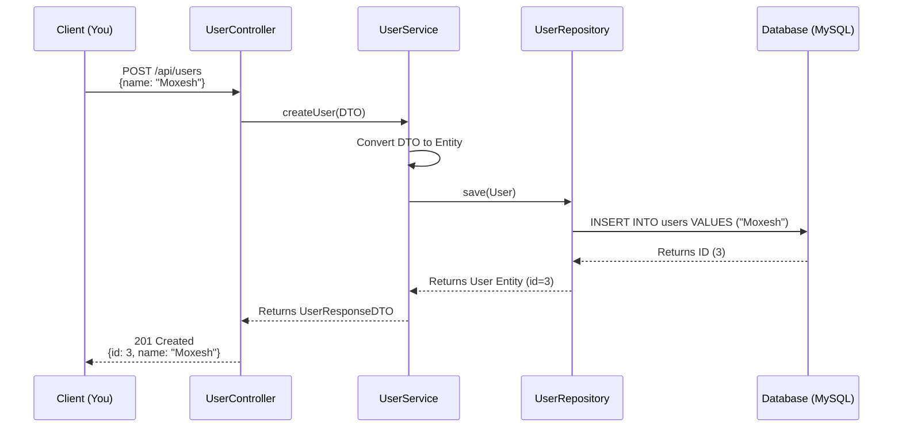
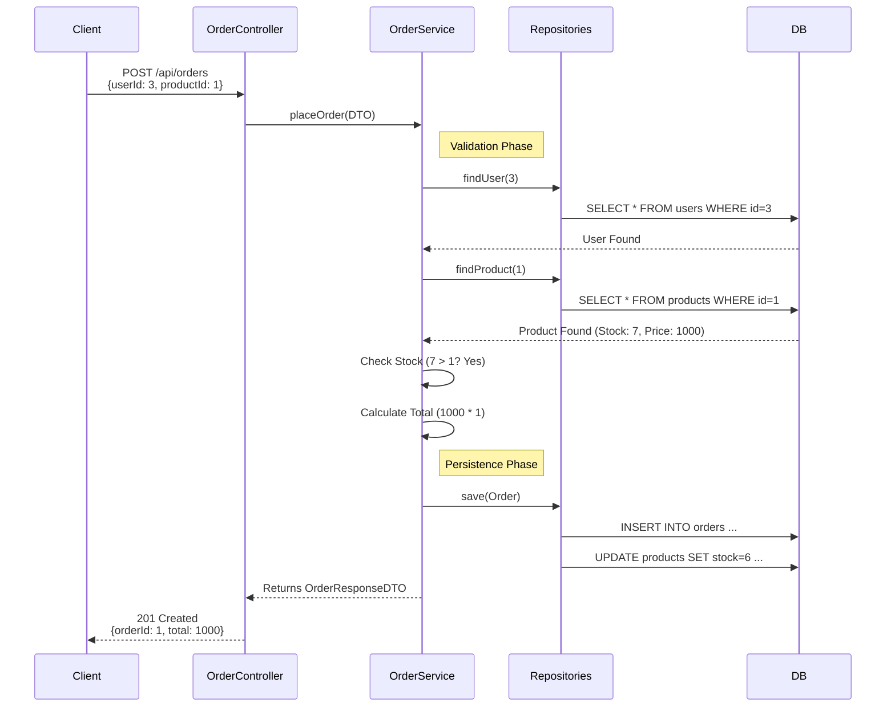
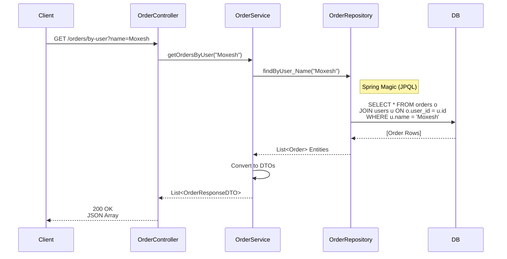
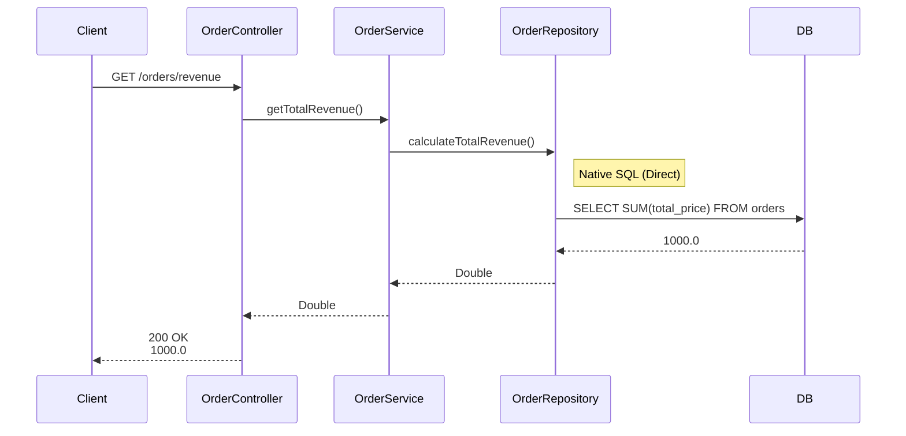

# API Flow Tutorial: Visualized

This guide visualizes the lifecycle of your requests using Sequence Diagrams.

---

## 1. Create User Flow
**Scenario**: You send `{"name": "Moxesh"}` to create a user.

---

## 2. Place Order Flow (Complex Logic)
**Scenario**: Moxesh (ID 3) buys 1 Laptop (ID 1).

---

## 3. "Find Orders by User" (JPQL Flow)
**Scenario**: Get all orders for User "Moxesh".

---

## 4. "Calculate Revenue" (Native SQL Flow)
**Scenario**: Get total earnings.

