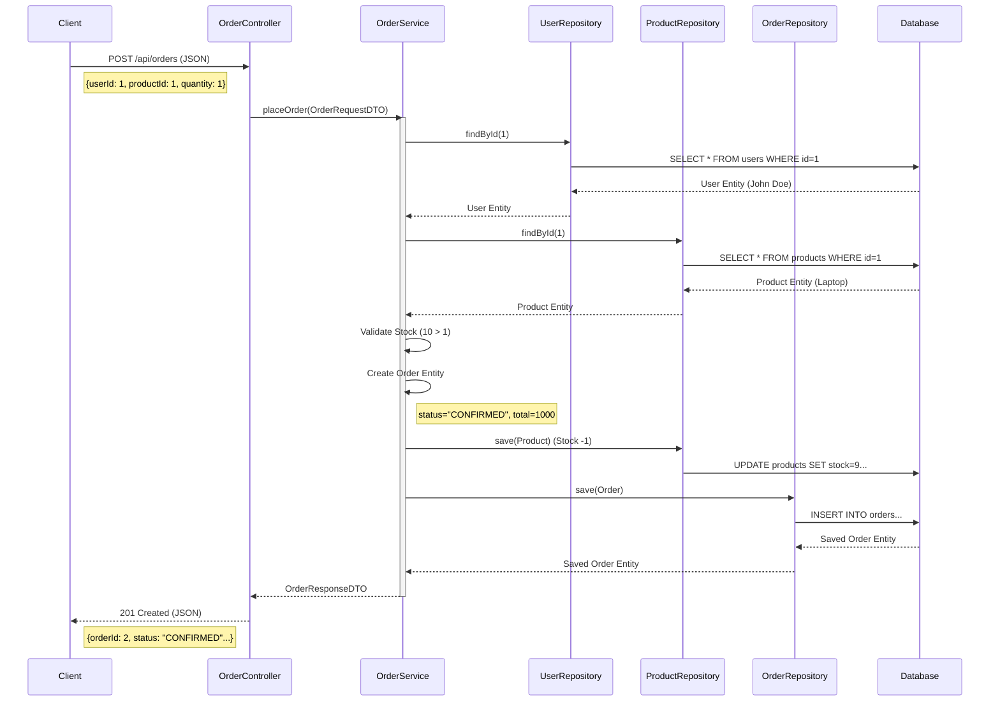

# API End-to-End Trace: Create Order

## Flow Diagram

## Step-by-Step Trace

1.  **Request**: The client sends a POST request with `userId: 1` and `productId: 1`.
2.  **Controller**: `OrderController` receives the JSON and converts it to `OrderRequestDTO`. It calls `orderService.placeOrder()`.
3.  **Service - Fetch Data**: `OrderService` asks `UserRepository` and `ProductRepository` for the entities.
4.  **Database Query**: Hibernate executes `SELECT` queries to get `User` and `Product` data.
5.  **Logic**: The Service checks if `Product.stock` is sufficient.
6.  **State Change**: A new `Order` object is created. The `Product` stock is decremented in memory.
7.  **Persist**: The Service calls `save()` on repositories. Hibernate executes `UPDATE` for the product and `INSERT` for the order.
8.  **Response**: The Service converts the saved Order entity into an `OrderResponseDTO` and returns it.
9.  **Reply**: The Controller wraps this in a `ResponseEntity` with HTTP 201 status and sends it back to the client.
